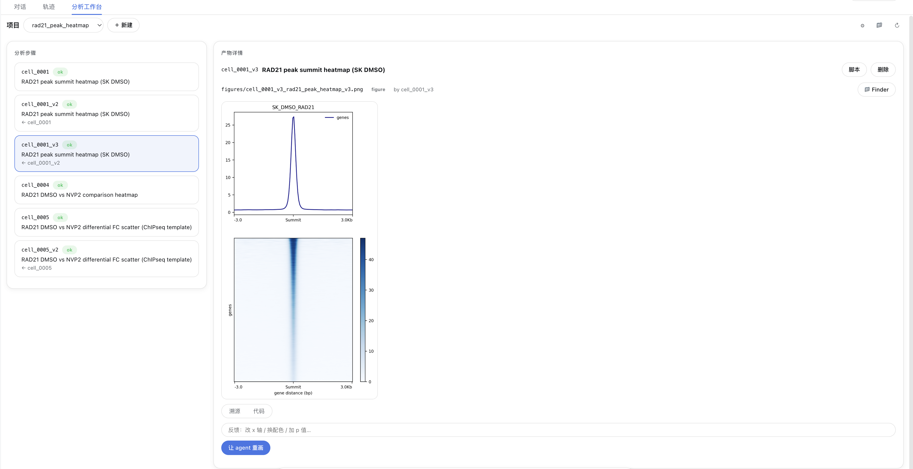
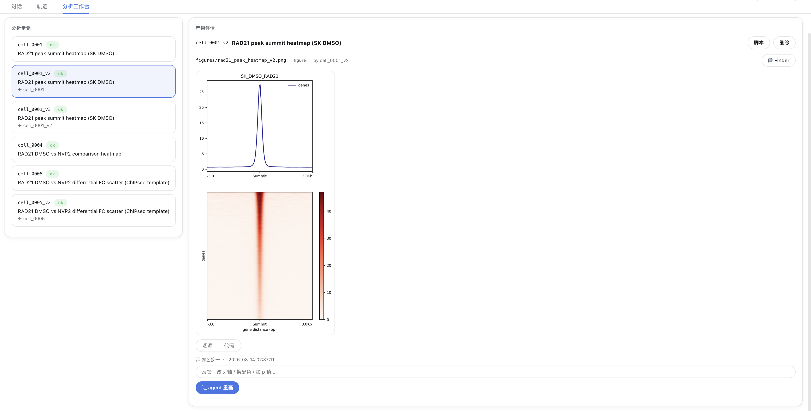

# dsh-science-workbench

[English](README.md) | 中文

[](https://www.npmjs.com/package/dsh-science-workbench)
[](./LICENSE)
[](https://github.com/deepseek-ai/deepseek-harness)

面向 [DeepSeek Harness](https://github.com/deepseek-ai/deepseek-harness) 的**可复现科学工作台**插件，融合三种范式的长处：

- **Jupyter** —— 可看、可重跑的 cell 与内联图；
- **Claude Science** —— agent 作为执行引擎；
- **Nextflow / nf-core** —— 每个产物都带完整 provenance。

> **核心承诺**：每张图、每个产物都可溯源、可重放。你永远能回答 *“它 = 哪段代码 + 哪些输入 + 什么环境 + 什么参数/种子”*，并一键重跑。

---

## ✨ 能力

- **代码出图 → 反馈 → 重画** —— agent 跑自包含 cell 出图、图内联显示；你给图挂结构化反馈，`bio_rerun_cell` 生成派生版本（`v1 → v2 → v3`）。
- **每项目一个账本** —— 明文 `manifest.json` 是唯一事实来源：cells、artifacts、provenance 与反馈历史。
- **天生可复现** —— 自包含脚本、每 cell 全新子进程、`environment.lock`、SHA-256 输入/输出哈希、固定 seed。
- **自动 git 版本化** —— 每个项目创建时 `git init`，每一步自动本地 commit（不 push）。
- **跨平台** —— Host shell 层 macOS/Linux 用 bash、Windows 用 PowerShell；Python 在 Windows 用 `python`、POSIX 用 `python3`。

## 🛠 工具

8 个 agent 工具 + 一个浏览器工作台：

| 工具 | 作用 |
|---|---|
| `bio_init_project` | 建/开项目：`code/ data/ figures/` + `manifest.json` + `environment.lock` + `git init`。 |
| `bio_run_cell` | 跑一个自包含 cell，发现图、登记产物哈希、提交。 |
| `bio_rerun_cell` | 用改过的代码重跑 cell，生成派生版本（记录 lineage）。 |
| `bio_add_feedback` | 给产物挂结构化反馈（“重画它”这条备注就这样变成历史）。 |
| `bio_get_project` | 返回项目摘要：cells、artifacts、provenance 与反馈。 |
| `bio_list_projects` | 列出 projects 根目录下的所有项目。 |
| `bio_set_projects_dir` | 设置项目存储根目录（跨重启持久化）。 |
| `bio_delete_cell` | 删除一个 cell 及其产物（脚本 + 图）。 |

**「分析工作台」** 标签页用三栏 UI 展示 notebook、产物、溯源与反馈，支持内联图预览（PNG/JPEG/SVG/PDF/TIFF/BMP）。

## 📸 截图

工作台标签页 —— 三栏布局：左侧「分析步骤」列表（含状态与派生链路 `cell_0001 → cell_0001_v2 → cell_0001_v3`），右侧「产物详情」（内联图 + 溯源/代码标签 + 脚本/删除/Finder 操作）。



反馈 → 重画回路 —— 每张图保留结构化反馈历史，一键「让 agent 重画」生成派生版本。



## 📦 安装

`dsh-science-workbench` 是一个 DSH 双面包（Host + Client）。用标准 `dsh plugin` 命令安装 —— 它是对 pnpm 的薄封装，把包装进 profile 并**自动加进 `dsh.profile.bundles`**（因为本包声明了 `dsh.bundle.patch`）。

```bash
# 从 npm（已发布）：
dsh plugin --profile web add dsh-science-workbench

# 本地开发（从源码目录）：
dsh plugin --profile web add file:/path/to/dsh-science-workbench
```

然后重启 `dsh web`。`bio_*` 工具全局可用、工作台标签页出现、插件在 **设置 → 插件** 里可见。

## 🚀 快速上手

装好并重启后，直接用大白话让 agent 干活：

> “帮我用 `demo_tss` 项目画一个 TSS 附近的信号热图。”

agent 会替你驱动工具。等价的手动流程是：

```text
1. bio_init_project { name: "demo_tss" }
2. bio_run_cell { title: "TSS profile", code: "..." }   # 写 figures/*.png
3. 看内联图 → bio_add_feedback { artifactPath, text: "把配色改成 Blues" }
4. bio_rerun_cell { cellId: "cell_0001", editedCode: "..." }  # → cell_0001_v2 + 新图
```

每一步都提交进项目的 git 历史、记进 `manifest.json`，整条 lineage（`cell_0001 → cell_0001_v2 → …`）随时可查。

## 🧪 可复现模型

每个 cell 是一个**自包含脚本**，带声明头：

```python
# @cell: cell_0001
# @title: TSS profile
# @language: python
# @seed: 42
# @params: {"colorMap": "Blues"}
# @inputs: ["data/peaks.bed"]
# @outputs: []
```

它在**全新子进程**里跑，`cwd = 项目根目录`。完成后 Host 会：

1. 发现写到 `figures/` 的图，并加 cell id 前缀；
2. 把每个输入/输出做 SHA-256 哈希，记进产物记录；
3. 把 cell + artifacts 追加进 `manifest.json`、更新 `index.md`；
4. 全部提交到项目的本地 git 仓库。

## 📁 项目布局

```
<workspace>/bio-projects/<name>/
├─ manifest.json        # 唯一事实来源：cells + artifacts + provenance + 反馈
├─ environment.lock     # 解释器版本 + pip freeze 快照
├─ index.md             # 人类可读的项目索引
├─ code/                # 每个 cell 一个自包含脚本（cell_0001.py, cell_0001_v2.py, …）
├─ data/                # 输入数据
├─ figures/             # 图（带 cell 前缀，如 cell_0001_tss_profile.png）
└─ .git/                # 自动创建、自动提交
```

## 🧩 架构

- **Host**（`lib/index.js`）是唯一事实来源。它把 `bio_*` 工具注册进宿主 `tools` 注册表、负责所有执行与溯源，并通过 `webServer` 服务 `/biowb/*` 数据路由。
- **Client**（`lib/client.js`）是纯投影 —— 手写的浏览器 bundle，经同源 `fetch('/biowb/<method>')` 读写。不依赖 typert Remote 桥、不需要 Harness monorepo 构建。
- **约定 skill**（`skills/bio-workbench`）教 agent 项目布局、cell 契约与反馈回路。

## 🌍 跨平台

| 操作 | macOS / Linux | Windows |
|---|---|---|
| Shell | bash | PowerShell |
| 哈希 | `shasum -a 256` | `Get-FileHash` |
| 建目录 / 移动 / 删除 | `mkdir -p` / `mv` / `rm -f` | `New-Item` / `Move-Item` / `Remove-Item` |
| 文件管理器打开 | `open` / `open -R` | `explorer.exe` / `explorer.exe /select,` |
| Python | `python3` | `python` |

## 🔧 开发

```bash
git clone https://github.com/poplarity/dsh-science-workbench
cd dsh-science-workbench

# 语法检查
npm run lint

# 装进你的 profile 并重启
dsh plugin --profile web add file:$(pwd)
```

结构：`lib/index.js`（Host）· `lib/client.js`（Client bundle）· `index.js`（入口再导出）· `cordis.patch.yml`（bundle 补丁）· `skills/`（约定 skill）· `docs/`（设计文档）· `examples/`（示例项目）。

## License

[MIT](./LICENSE)
